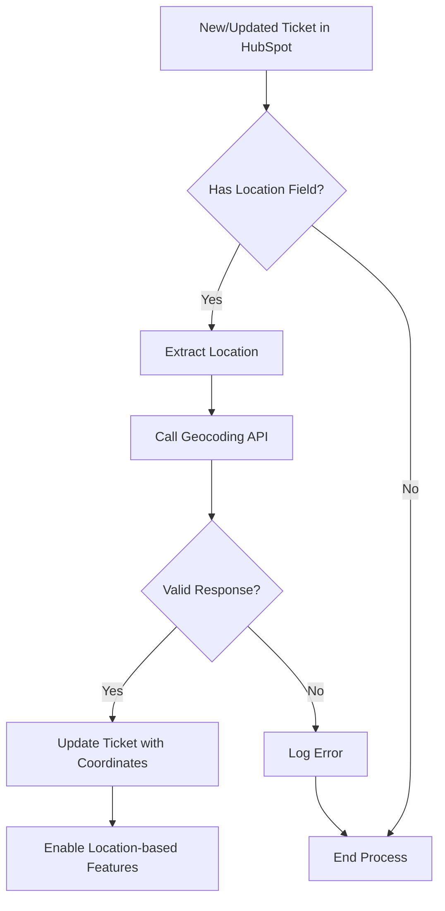

This guide explains how to integrate the Geocoding API with HubSpot to automatically geocode ticket locations.

## Auto-Geocoding HubSpot Tickets

The Geocoding API can be used to automatically geocode ticket locations in HubSpot, enabling powerful location-based workflows and visualizations.

### Integration Flow



### Implementation Example

#### API Endpoint

```http
GET https://api-v1.compass.com/geo-locations/address/{location}
```

#### Power Automate/Flow Example

1. **Trigger**: When a ticket is created or updated in HubSpot
2. **Action**: HTTP Request to Geocoding API
   - **Method**: GET
   - **URL**: `https://api-v1.compass.com/geo-locations/address/@{outputs('Pickup_Location')}`
   - **Headers**:
     ```
     Authorization: Bearer YOUR_JWT_TOKEN
     ```

3. **Parse Response**: Extract latitude and longitude
4. **Update Ticket**: Store coordinates in custom fields

#### Response Handling

```json
{
  "message": "",
  "data": {
    "address": {
      "city": "New York",
      "state": "New York",
      "country": "US",
      "lat": 40.7128,
      "long": -73.0060
    }
  }
}
```

### Common Use Cases

1. **Map Visualizations**: Display ticket locations on a map
2. **Proximity Alerts**: Notify agents of nearby tickets
3. **Routing Optimization**: Plan efficient service routes
4. **Geofencing**: Trigger actions based on location boundaries

### Best Practices

1. **Error Handling**: Implement retry logic for failed requests
2. **Rate Limiting**: Stay within API rate limits
3. **Data Caching**: Cache responses for frequently used locations
4. **Field Mapping**: Clearly document which HubSpot fields store the geocoded data

### Troubleshooting

| Issue | Possible Cause | Solution |
|-------|----------------|----------|
| 401 Unauthorized | Missing or invalid token | Verify JWT token in Authorization header |
| 404 Not Found | Location not found | Check address format and try alternative spellings |
| 429 Too Many Requests | Rate limit exceeded | Implement exponential backoff and retry logic |
| Invalid Coordinates | API response parsing error | Verify response format and field mappings |

### Example Workflow

1. **Ticket Creation**:
   - Customer submits ticket with location "JFK Airport"
   - Workflow triggers on ticket creation
   - API converts "JFK" to coordinates (40.6413° N, 73.7781° W)
   - Ticket is updated with coordinates

2. **Visualization**:
   - Globe component displays ticket location
   - Heatmap shows concentration of tickets by area
   - Service teams can prioritize based on location

### Support

For assistance with HubSpot integration, contact [dev@sunnylimo.com](mailto:dev@sunnylimo.com).
