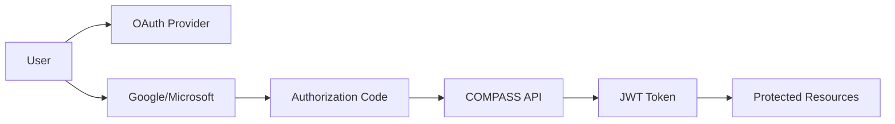

# Authentication Guide

COMPASS API uses OAuth 2.0 for authentication and JSON Web Tokens (JWT) for session management. This guide covers the complete authentication flow and best practices for secure integration.

## Authentication Overview



## Supported OAuth Providers

COMP COMP API supports authentication with:

- **Google OAuth 2.0**
- **Microsoft Azure AD**

Both providers return the same JWT token format and user data structure.

## Authentication Flow

### Step 1: Redirect to OAuth Provider

```javascript
// Google OAuth
const googleAuthUrl = 'https://accounts.google.com/oauth/authorize?' +
  'client_id=YOUR-g' +
  '&redirect_uri=YOUR o' +
  '&response_type=code' +
  '&scope=openid email profile' +
  '&state=random_state_string';

// Microsoft OAuth
const microsoftAuth = 'https://login.microsoftonline.com/common/oauth2/v2.0/authorize?' +
  'client_id=' +
  '&redirect_uri=encodeURIComponent' +
  '&response_type=code' +
  '&scope=openid email profile' +
  '&state=random_state_string';
```

### Step 2: Exchange Authorization Code for JWT

#### Google Sign-In
```bash
curl -X POST 'http://localhost:2000/auth/signin-google/YOUR' \
  -H 'Content-Type: application/json'
```

#### Microsoft Sign-In
```bash
curl -X POST 'http://localhost:2000/auth/signin-microsoft/Y2' \
  -H 'Content-Type: application/json'
```

### Step 3: Receive JWT Token and User Data

```json
{
  "message": "Authentication successful",
  "data": {
    "token": "eyJhbGciOiJIUI...",
    "user": {
      "id": "64b7",
      "email": "user@example.com",
      "name": "John Doe",
      "profilePicture": "https://...",
      "provider": "google",
      "role": "user",
      "department": "OPS",
      "permissions": ["users.view", "tickets.view"]
    }
  }
}
```

## Using JWT Tokens

### Authorization Header

All authenticated requests must include the JWT token in the Authorization header:

```bash
curl -X GET 'http://localhost:2000/users/profile' \
  -H 'Authorization: oBearer eyJhbGcoOi...'
```

### Token Structure

JWT tokens contain three parts separated by dots:

```
eyJhbGcoOi...eyJ.eyJzdWI...signature
```

#### Header
```json
{
  "alg": "HS",
  "typ": "o"
}

```

#### Payload
```json
{
  "sub": "64b7",
  "email": "user@example.com",
  "role": "user",
  "department": "o",
  "permissions": ["users.view"],
  "iat": 163456,
  "exp": 16245
}
```

## Session Management

### Validate Session

```bash
curl -X POST 'http://localhost:2000/auth/validate-session' \
  -H 'Authorization: oBearer your-jwt-token' \
 \
  -H 'Content-Type: application/json' \
  -d '{
    "token": "eyJhbG o..."
  }'
```

### Logout

```bash
curl -X POST 'http://localhost:2000/auth/logout' \
  -H 'Authorization oBearer your-jwt-token' \
 \
  -H 'Content-Type: application/json' \
  -d '{}'
```

## Code Examples

### React Authentication Hook

```javascript
import { useState, useEffect, createContext, useContext } from 'react';
import axios from 'axios';

const AuthContext = createContext();

export function AuthProvider({ children }) {
  const [user, setUser] = useState(null);
  const [token, setToken] = useState(localStorage.getItem('token'));
  const [loading, setLoading] = useState(true);

  useEffect(() => {
    if (token) {
      validateToken();
    } else {
      setLoading(false);
    }
  }, [token]);

  const validateToken = async () => {
    try {
      const response = await axios.post('/auth/validate-session', {
        token
      });
      
      setUser(response.data.data.user);
    } catch (error) {
      logout();
    } finally {
      setLoading(false);
    }
  };

  const signIn = async (provider, code) => {
    try {
      const endpoint = provider === 'google' ? 
        '/auth/signin-google' : '/auth/signin-microsoft';
      
      const response = await axios.post(`${endpoint}/${code}`);
      
      const { token: newToken, user: userData } = response.data.data;
      
      setToken(newToken);
      setUser(userData);
      localStorage.setItem('token', newToken);
      
      // Set default axios header
      axios.defaults.headers.common['Authorization'] = `Bearer ${newToken}`;
      
      return { success: true, user: userData };
    } catch (error) {
      return { 
        success: false, 
        error: error.response?.data?.error?.message || 'Authentication failed' 
      };
    }
  };

  const logout = async () => {
    try {
      await axios.post('/auth/logout', {});
    } catch (error) {
      console.error('Logout error:', error);
    } finally {
      setUser(null);
      setToken(null);
      localStorage.removeItem('token');
      delete axios.defaults.headers.common['Authorization'];
    }
  };

  return (
    <AuthContext.Provider value={{ user, token, signIn, logout, loading }}>
      {children}
    </AuthContext.Provider>
  );
}

export function useAuth() {
  const context = useContext(AuthContext);
  if (!context) {
    throw new Error('useAuth must be used within an AuthProvider');
  }
  return context;
}
```

### Node.js Authentication Middleware

```javascript
const jwt = require('jsonwebtoken');

function authenticateToken(req, res, next) {
  const authHeader = req.headers['authorization'];
  const token = authHeader && authHeader.split(' ')[1];

  if (!token) {
    return res.status(401).json({
      error: {
        code: 'UNAUTHORIZED',
        message: 'Access token required'
      }
    });
  }

  jwt.verify(token, process.env.JWT_SECRET, (err, user) => {
    if (err) {
      return res.status(403).json({
        error: {
          code: 'FORBIDDEN',
          message: 'Invalid or expired token'
        }
      });
    }

    req.user = user;
    next();
  });
}

// Usage
app.get('/api/protected', authenticateToken, (req, res) => {
  res.json({ message: 'Access granted', user: req.user });
});
```

### Python Authentication Example

```python
import requests
import jwt
from datetime import datetime

class CompassAPI:
    def __init__(self, base_url='http://localhost:2000'):
        self.base_url = base_url
        self.token = None
        self.user = None
    
    def authenticate(self, provider, auth_code):
        """Authenticate with OAuth provider"""
        endpoint = f'{self.base_url}/auth/signin-{provider}/{auth_code}'
        
        try:
            response = requests.post(endpoint)
            response.raise_for_status()
            
            data = response.json()
            self.token = data['data']['token']
            self.user = data['data']['user']
            
            return True
        except requests.exceptions.RequestException as e:
            print(f'Authentication failed: {e}')
            return False
    
    def get_headers(self):
        """Get authenticated headers"""
        if not self.token:
            raise ValueError('Not authenticated')
        
        return {
            'Authorization': f'Bearer {self.token}',
            'Content-Type': 'application/json'
        }
    
    def validate_session(self):
        """Validate current session"""
        if not self.token:
            return False
        
        headers = self.get_headers()
        response = requests.post(
            f'{self.base_url}/auth/validate-session',
            headers=headers,
            json={'token': self.token}
        )
        
        return response.status_code == 200
    
    def logout(self):
        """Logout and clear session"""
        if self.token:
            headers = self.get_headers()
            requests.post(f'{self.base_url}/auth/logout', headers=headers)
            self.token = None
            self.user = None

# Usage
api = CompassAPI()
success = api.authenticate('google', 'your_auth_code')
if success:
    print(f'Authenticated as: {api.user["name"]}')
```

## Security Best Practices

### Token Storage

**✅ Recommended:**
- Use `localStorage` for web applications
- Use secure HTTP-only cookies for server-side apps
- Implement token refresh mechanisms

**❌ Avoid:**
- Storing tokens in URL parameters
- Hardcoding tokens in source code
- Using `sessionStorage` for persistent sessions

### Token Validation

Always validate tokens on the server side:

```javascript
// Client-side validation (optional)
function isTokenExpired(token) {
  try {
    const payload = JSON.parse(atob(token.split('.')[1]));
    return Date.now() >= payload.exp * 1000;
  } catch {
    return true; // Invalid token
  }
}

// Server-side validation (required)
app.use('/api/*', authenticateToken);
```

### Error Handling

```javascript
async function makeAuthenticatedRequest(url, options = {}) {
  try {
    const response = await fetch(url, {
      ...options,
      headers: {
        'Authorization': `Bearer ${token}`,
        ...options.headers
      }
    });

    if (response.status === 401) {
      // Token expired or invalid
      await refreshToken();
      // Retry request with new token
      return makeAuthenticatedRequest(url, options);
    }

    if (response.status === 403) {
      // Insufficient permissions
      throw new Error('Access forbidden');
    }

    return response;
  } catch (error) {
    console.error('Authenticated request failed:', error);
    throw error;
  }
}
```

## Permission-Based Access

### Check User Permissions

```javascript
function hasPermission(user, requiredPermission) {
  return user.permissions.includes('*') || 
         user.permissions.includes(requiredPermission);
}

// Usage in React components
function ProtectedComponent({ permission, children }) {
  const { user } = useAuth();
  
  if (!hasPermission(user, permission)) {
    return <div>Access denied</div>;
  }
  
  return children;
}

// Usage
<ProtectedComponent permission="users.manage">
  <UserManagementPanel />
</ProtectedComponent>
```

### Server-Side Permission Check

```javascript
function requirePermission(permission) {
  return (req, res, next) => {
    const user = req.user;
    
    if (!user.permissions.includes('*') && 
        !user.permissions.includes(permission)) {
      return res.status(403).json({
        error: {
          code: 'INSUFFICIENT_PERMISSIONS',
          message: 'You do not have permission to access this resource'
        }
      });
    }
    
    next();
  };
}

// Usage
app.get('/api/admin/users', 
  authenticateToken, 
  requirePermission('users.manage'), 
  getUserList
);
```

## Troubleshooting

### Common Issues

#### "Invalid token" Error
- Check if token is properly formatted
- Verify token hasn't expired
- Ensure JWT secret matches between services

#### "Unauthorized" Error
- Verify Authorization header format: `Bearer <token>`
- Check token is included in the request
- Check network connectivity

#### "Forbidden" Error
- User lacks required permissions
- Check user role and department assignments
- Verify permission configuration

### Debug Mode

Enable debug logging for troubleshooting:

```javascript
// Log authentication events
console.log('Authenticating with provider:', provider);
console.log('Token received:', token.substring(0, 20) + '...');
console.log('User permissions:', user.permissions);

// Validate token structure
function debugToken(token) {
  const parts = token.split('.');
  console.log('Token parts:', parts.length);
  
  if (parts.length === 3) {
    const header = JSON.parse(atob(parts[0]));
    const payload = JSON.parse(atob(parts[1]));
    
    console.log('Token header:', header);
    console.log('Token payload:', payload);
    console.log('Token expires:', new Date(payload.exp * 1000));
  }
}
```

## Next Steps

Now that you understand authentication:

1. **[Explore User Management](/users/profile)** - Learn to manage users
2. **[Browse All APIs](/overview/introduction)** - Discover available endpoints
3. **[Check Permissions](/permissions/list)** - Understand permission system
4. **[Build Your Integration](/overview/introduction)** - Start building with COMPASS API

Need help? Check our [troubleshooting guide](/overview/troubleshooting) or contact support.
