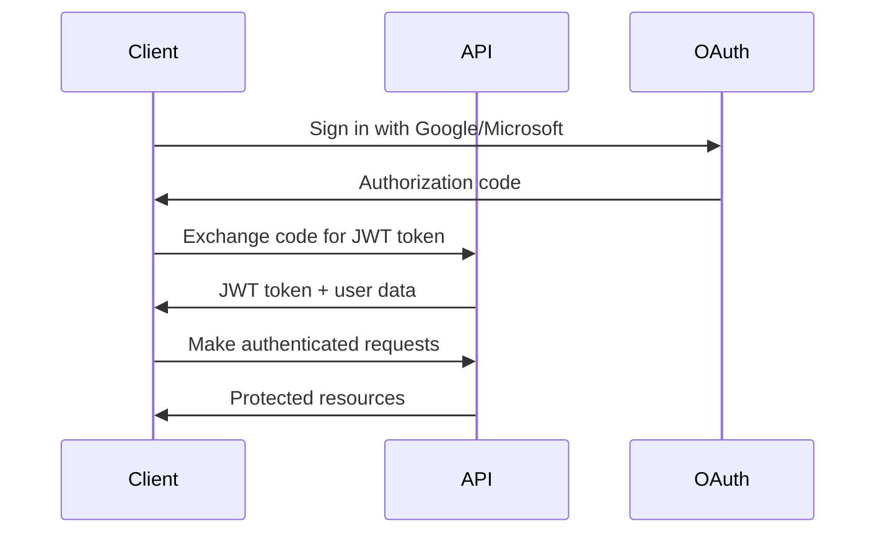

# Welcome to COMPASS API

COMPASS is a comprehensive transportation management system that provides powerful APIs for managing users, departments, email analytics, customer support tickets, permissions, and audio transcription services.

## Getting Started

This documentation provides complete reference information for all COMPASS API endpoints, including detailed request/response examples, authentication requirements, and best practices for integration.

### Quick Start

1. **Authentication**: All API calls require a valid JWT token
2. **Base URL**: `http://localhost:2000`
3. **Content Type**: `application/json` for most endpoints
4. **Rate Limiting**: Check specific endpoints for any rate limits

## API Overview

### Core Services

| Service | Description | Endpoints |
|---------|-------------|-----------|
| **Authentication** | OAuth integration and session management | 4 endpoints |
| **User Management** | Complete user lifecycle and permissions | 10 endpoints |
| **Departments** | Organizational structure and team management | 7 endpoints |
| **Email Meter** | Advanced email analytics and reporting | 12 endpoints |
| **HubSpot Tickets** | Customer support ticket management | 4 endpoints |
| **Permissions** | System-wide permission management | 1 endpoint |
| **Transcription** | Audio-to-text conversion services | 2 endpoints |

### Authentication Flow



## Key Features

### Secure Authentication
- OAuth 2.0 integration with Google and Microsoft
- JWT-based session management
- Role-based access control
- Admin-only endpoints protection

### Comprehensive User Management
- User profile management
- Department assignment and role management
- Permission-based access control
- Account linking and matching

### Department Organization
- Hierarchical department structure
- User assignment and manager roles
- Department-based permissions
- Organizational analytics

### Advanced Email Analytics
- Real-time email monitoring
- Performance metrics and SLA tracking
- Agent productivity analytics
- Client domain insights
- Hourly and trend analysis

### Customer Support Integration
- HubSpot ticket management
- Advanced filtering and search
- Multi-format export capabilities
- Real-time ticket processing

### Audio Transcription
- Automated speech-to-text conversion
- Multi-language support
- Confidence scoring and segmentation
- Transcription management

## Making Your First API Call

### 1. Authenticate

```bash
# Sign in with Google
curl -X POST 'http://localhost:2000/auth/signin-google/your-auth-code' \
  -H 'Content-Type: application/json'
```

### 2. Use Your Token

```bash
# Get user profile with JWT token
curl -X GET 'http://localhost:2000/users/profile' \
  -H 'Authorization: Bearer your-jwt-token'
```

## Response Format

All API responses follow a consistent format:

### Success Response
```json
{
  "message": "Success message",
  "data": {
    // Response data here
  }
}
```

### Error Response
```json
{
  "error": {
    "code": "ERROR_CODE",
    "message": "Human-readable error message"
  }
}
```

## HTTP Status Codes

| Code | Description |
|------|-------------|
| `200` | Success |
| `400` | Bad Request |
| `401` | Unauthorized |
| `403` | Forbidden |
| `404` | Not Found |
| `500` | Internal Server Error |

## SDK and Libraries

While we don't provide official SDKs yet, our RESTful API is designed to work seamlessly with any HTTP client library:

- **JavaScript/Node.js**: `fetch`, `axios`
- **Python**: `requests`
- **Java**: `OkHttp`, `Retrofit`
- **C#**: `HttpClient`
- **Ruby**: `Net::HTTP`

## Rate Limiting

API calls are subject to rate limiting to ensure fair usage:

- **Standard endpoints**: 1000 requests per hour
- **Authentication endpoints**: 100 requests per hour
- **Export endpoints**: 50 requests per hour

Rate limit headers are included in all responses:
```http
X-RateLimit-Limit: 1000
X-RateLimit-Remaining: 999
X-RateLimit-Reset: 1634567890
```

## Best Practices

### Security
- Always use HTTPS in production
- Store JWT tokens securely
- Implement token refresh logic
- Validate all input data

### Performance
- Use appropriate pagination
- Cache static data when possible
- Implement retry logic for failed requests
- Monitor API usage and optimize

### Error Handling
- Always check HTTP status codes
- Handle rate limit responses gracefully
- Implement exponential backoff for retries
- Log errors for debugging

## Support

- **Documentation**: This comprehensive guide
- **Status Page**: Check system status
- **Support Email**: support@example.com
- **GitHub**: Report issues and contribute

## What's Next?

1. **Explore Authentication**: Learn about our OAuth integration
2. **Browse APIs**: Discover all available endpoints
3. **Try Examples**: Use our code samples to get started
4. **Build Integration**: Start building with COMPASS API

Ready to dive in? Check out our [Authentication Guide](/overview/authentication) to get started with secure API access.
