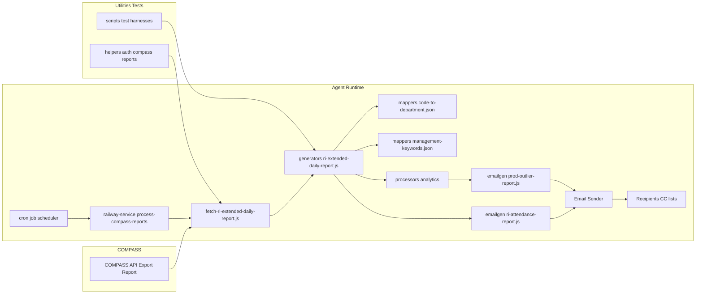

# Reporting Agent Architecture

The COMPASS Reporting Agent is an automated system that processes daily reports, enriches data with business logic, and generates email reports for stakeholders. The system runs on a scheduled basis and handles multiple report types including attendance, utilization, and performance analytics.

## Component Mapping

### COMPASS export
- **Raw report source**: Excel/CSV files exported from COMPASS API
- **Consumed by**: `fetch-ri-Through-daily-report.js`
- **Purpose**: Provides the raw data that needs processing and analysis

### fetch-ri-Through-daily-report.js
- **Function**: Downloads and parses spreadsheet files
- **Returns**: Raw row data for further processing
- **Location**: Entry point for the data pipeline

### generators/ri-Through-daily-report.js
- **Function**: Transforms raw rows into structured records
- **Key fields generated**: `expectedHours`, `totalTimeOnFloorHours`, `breakMinutes`, `shiftCompletionPercentage`, `isAbsent`, `isOnTime`
- **Purpose**: Applies business logic and calculations to raw data

### mappers/code-to-department.json
- **Function**: Maps department codes to human-readable names
- **Used by**: Generator for department resolution
- **Purpose**: Provides consistent department naming across reports

### mappers/management-keywords.json
- **Function**: Contains keywords to identify management roles
- **Used by**: `ri-attendance-report.js` for filtering
- **Purpose**: Excludes management from performance calculations

### processors/*
- **Function**: Run per-report analytics and calculations
- **Types**: Average call length, outliers, longest calls
- **Purpose**: Generates insights and performance metrics

### ri-attendance-report.js & emailgen/prod-outlier-report.js
- **Function**: Generate email HTML and data for each report type
- **Input**: Processed and enriched data
- **Output**: Formatted email content ready for delivery

### delivery/ri-email-sender.js
- **Function**: Sends generated emails to recipients
- **Handles**: SMTP delivery, recipient lists, CC management
- **Purpose**: Final delivery step in the pipeline

### cron/process-compass-reports.js, cron/scheduler.js, cron/railway-service.js
- **Function**: Scheduling and coordination
- **Triggers**: Automated execution of fetch → process → send workflow
- **Purpose**: Ensures timely report generation and delivery

### helpers/*
- **Function**: Shared utilities and common functions
- **Types**: Authentication helpers, COMPASS API helpers, report helpers
- **Purpose**: Code reuse and consistency across components

### scripts/*.js
- **Function**: Local test harnesses and development tools
- **Usage**: Run during development for testing and debugging
- **Purpose**: Enable local development and testing workflows

## Workflow Process

1. **Scheduling**: Cron job triggers the railway service
2. **Data Fetch**: Resource Inn data is downloaded and parsed
3. **Data Enrichment**: Raw rows are transformed with business logic
4. **Mapping**: Department codes and management roles are resolved
5. **Processing**: Analytics and calculations are applied
6. **Report Generation**: HTML emails are created for each report type
7. **Delivery**: Emails are sent to configured recipients

## Configuration Points

- **Department mappings**: Update `code-to-department.json` for new departments
- **Management filtering**: Modify `management-keywords.json` to change exclusion rules
- **Scheduling**: Adjust cron expressions in scheduler files
- **Recipients**: Configure email lists in delivery components
- **Thresholds**: Modify calculation logic in generator files

## Development & Testing

Use the scripts in the `scripts/` directory for local testing:
- Test data processing workflows
- Validate email generation
- Debug calculation logic
- Test configuration changes
