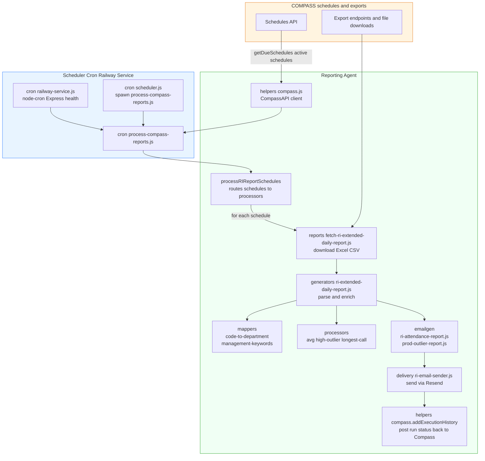

# Attendance & Utilization Report — System overview

## Summary

The agent runs scheduled jobs that query Compass for due report schedules, download the exported Resource Inn report (Excel/CSV), parse and enrich rows, map department codes, filter management roles, compute utilization and attendance flags, run analytic processors (outliers, longest calls, average call length), generate HTML emails, and send them via the configured email delivery provider (Resend). Execution results and status are posted back to Compass.

## High-level flow

COMPASS Schedules API (helpers/compass.js) → Scheduler (scheduler.js or Railway service) triggers process-compass-reports.js → processRIReportSchedules iterates due schedules → for each schedule, fetch the report (reports/fetch-ri-extended-daily-report.js) → parse & enrich (generators/ri-extended-daily-report.js) → apply mappers (mappers/code-to-department.json, mappers/management-keywords.json) → run processors (processors/) → generate emails (emailgen/) → send (delivery/ri-email-sender.js) → addExecutionHistory back to Compass.

## Files & Locations

- **`helpers/compass.js`** — Compass API client and schedule processing entrypoints (healthCheck, fetchActiveSchedules, fetchScheduleById, getDueSchedules, addExecutionHistory). Responsible for routing schedules by reportType and enforcing Resource Inn sync.

- **`process-compass-reports.js`** — CLI cron job that is executed by the scheduler. Calls CompassAPI and delegates to processRIReportSchedules.

- **`scheduler.js` and `railway-service.js`** — scheduling / always-on service that triggers process-compass-reports.js. Railway exposes manual trigger endpoints and health/status pages.

- **`reports/fetch-ri-extended-daily-report.js`** — downloads the report file(s) (Excel/CSV) from Resource Inn or Compass export endpoints and returns raw rows/path to local temp file.

- **`generators/ri-extended-daily-report.js`** — transforms raw rows into structured records (expectedHours, totalTimeOnFloorHours, breakMinutes, shiftCompletionPercentage, isAbsent, isOnTime, isLate), and applies department mapping.

- **`mappers/code-to-department.json`** — maps department codes from Compass to Resource Inn department name variants used by the generator for filtering.

- **`mappers/management-keywords.json`** — centralized list of management keywords used to exclude management roles (case-insensitive substring match) in ri-attendance-report.js.

- **`processors/*`** — analytics modules for average call length, outliers, longest call.

- **`emailgen/ri-attendance-report.js`** — filters management roles, applies performance thresholds, builds the attendance HTML payload.

- **`delivery/ri-email-sender.js`** — sends generated HTML via Resend API and returns email id and recipients.

- **`helpers/compass.addExecutionHistory`** — records result status back in Compass for observability.

## Routing & Triggers

### Schedule Processing Rules
- **Due-only vs forceAll**: Schedules from Compass include `reportType` and `department` (with `code`). Only schedules with `hasResourceInnSync` are processed.
- **Department routing**: `processRIReportSchedules` routes per-schedule using the schedule department code to pass into generator/email functions so the final output is department-scoped.
- **Manual triggers**: Railway `/trigger` and `/trigger/:scheduleId` endpoints can force processing of all schedules or a single schedule by ID.

### Trigger Types
- **Scheduled**: Cron-based execution via `scheduler.js`
- **Manual**: Railway service endpoints for on-demand processing
- **Health checks**: Built-in health endpoints for monitoring

## How to Change Behavior

### Schedule Configuration
To adjust which schedules run, configure Compass schedule settings (cron & Resource Inn sync).

### Management Filtering
To change management filtering, edit `management-keywords.json`:
```json
["Manager", "Lead", "Supervisor", "Director"]
```

### Performance Thresholds
To change thresholds (low performance / break limits), search `0.75` and `> 65` in the repo (in `ri-attendance-report.js`) and update logic in that file:
```javascript
// Low performance threshold
isLowPerformance = totalTimeOnFloorHours < (expectedHours * 0.75);

// Excessive break threshold
hasExcessiveBreak = breakMinutes > 65;
```

### Department Mapping
Update `code-to-department.json` to add or modify department code mappings.

## Troubleshooting

### Common Issues

**Compass Health Check Errors**
- **401 Unauthorized**: Check `COMPASS_API_KEY` environment variable
- **404 Not Found**: Verify `COMPASS_URL` is correct and API is accessible
- **Connection timeout**: Check network connectivity and firewall settings

**Missing Environment Variables**
Required variables:
```bash
COMPASS_URL=https://your-compass-instance.com
COMPASS_API_KEY=your-api-key
RESEND_API_KEY=your-resend-key
```

**File Cleanup Issues**
- Temporary files not cleaned up: Check temp directory permissions
- Large file downloads failing: Verify disk space and download limits
- Excel parsing errors: Validate file format and encoding

**Schedule Processing**
- No schedules processed: Check `hasResourceInnSync` flag in Compass
- Duplicate emails: Verify schedule uniqueness and timing
- Missing department data: Validate `code-to-department.json` mappings

### Debug Commands
```bash
# Test Compass connection
node helpers/compass.js --health-check

# Test schedule processing
node process-compass-reports.js --dry-run

# Manual trigger specific schedule
curl -X POST "http://localhost:3000/trigger/SCHEDULE_ID"
```

## Development & Testing

### Local Development
1. Set up environment variables
2. Run health check: `node helpers/compass.js --health-check`
3. Test schedule processing: `node process-compass-reports.js --dry-run`
4. Verify email generation locally before sending

### Testing Workflow
```bash
# Test individual components
node scripts/test-ri-extended-daily-report.js
node scripts/test-attendance-report.js

# Full integration test
node process-compass-reports.js --test-mode
```

## Monitoring & Observability

### Execution History
All runs are logged back to Compass via `addExecutionHistory` including:
- Schedule ID and timestamp
- Success/failure status
- Records processed
- Email delivery results
- Error details (if applicable)

### Health Endpoints
- `/health` - Overall system health
- `/status` - Detailed component status
- `/metrics` - Processing statistics

The Reporting Agent provides a robust, scalable solution for automated report processing with comprehensive error handling, monitoring, and configuration flexibility.
